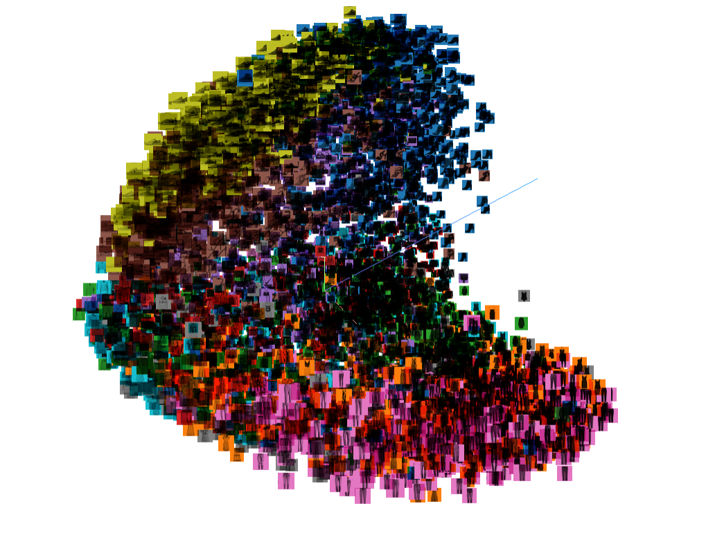
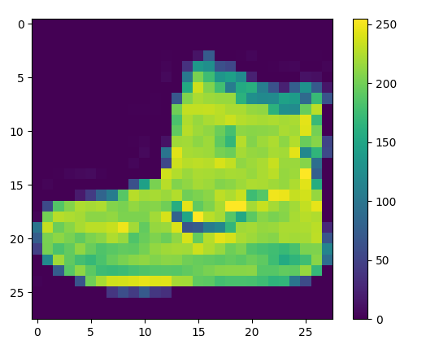

# CS273A Final Project - Fashion MNIST Exploration

## Data Visualization

#### Requirements

1. `pip install matplotlib numpy tensorflow==1.14.0`
2. Make sure the fashion-mnist directory is added as Sources Root in PyCharm, or that it can be found in `PYTHONPATH`
3. To run NN models, download project and open the files in juypter notebook. Make sure to have the data folder from fashion-mnist in your local directory.
4. `pip install opencv-python imutils` 

#### Tensorboard

`python visualization.py --tensorboard`

Dumps Tensorboard files to the directory `/tensor`. The data can be inspected in a Tensorboard with

1. `tensorboard --logdir=tensorvis --host localhost` from project root directory
2. Open browser and go to `localhost:6006`. You might need to refresh a few times.

#### Single image

`python visualization.py --single <0-59999>`

A single image at index <single> will pop up. This should be a value between 0 and 59999 (there are 60000 training images). Each image has 784 (28x28) pixels and each pixel is a value 0-255. The pixel values are shown using a colormap.

